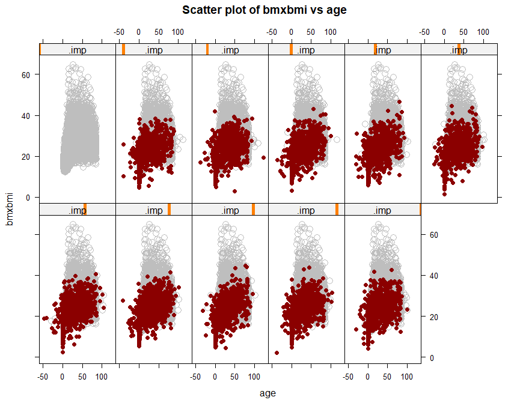

```{r setup, echo = FALSE, include=FALSE}

options(warn=-1)
options(xtable.comment = FALSE)

library(ggplot2)
library(xtable)
library(mice)
library(VIM)

```

# Question I

```{r echo = FALSE, include=FALSE}
df <- read.csv("./data/treeage.txt", 
               stringsAsFactors = FALSE, 
                strip.white=TRUE)


df <- df[, -1]

summary(df)
str(df)
miss_data <- df

```
 
## Task 1.1 


```{r echo = FALSE, include=FALSE}
set.seed(95)
miss_data[head(sample(20), 0.3 * nrow(miss_data)), ]$age <- NA
```

The following code is used to replace 30% age with missing value randomly. 

```
missing_data[head(sample(20), 0.3 * nrow(df)), ]$age <- NA
```

This is the new dataset with missing value.

```{r echo = FALSE, results='asis'}
xtable(miss_data)
```


```{r echo = FALSE, include=FALSE}
tree_imp <- mice(miss_data,
                 m=50, 
                 defaultMethod=c("norm","logreg","polyreg","polr"), 
                 print=F)

```

## Task 1.2 

```{r echo = FALSE, message=FALSE, out.width=c('50%'), fig.align='center'}

densityplot(tree_imp, 
            scales = list(x = list(relation = "free")), 
            ayout = c(2, 1),  
            main = "Marginplot Distribution of Multiple Imputation")
```

```{r echo = FALSE, message=FALSE, out.width=c('50%', '50%', '50%', '50%')}

for (imp_index in c(1:4)) {
  print(ggplot( data.frame(diameter=miss_data$diameter, 
                   age = complete(tree_imp, imp_index)$age,  
                   missing = is.na(miss_data$age) ), 
        aes(y = age, x = diameter,  color = missing)) +
        geom_point() +
        theme_classic() +
        ggtitle(sprintf("Missing value and observed value for impuned dataset : %d",                                imp_index)))
}

```


**Conclusion:**
According to the scatter plot, the result is acceptable since the added data are in a reasonable range. Most of the imputed ages are larger than the real value for a small diameter data point. However, one of the imputed datasets predicts a very close value of real age. According to marginal distribution, most of the imputed data's distribution is similar to observed data, except for a few too centered distributions. Considering the tiny size of the dataset, the few exceptionals are acceptable. 
 
## Task 1.3

The model is :

$$
age_{i} = \beta_{1}*diameter_{i} + \beta_{0} + \varepsilon_{i};\varepsilon \overset{iid}{\sim} \mathcal{N}(\mu,\,\sigma^{2})\
$$

The assessment plot of one of the imputed datasets is as follows. According to residual analysis, there is no obvious evidence indicate the assumptions of linear regression were broken. There are some high leverage points; however,  there are not high influence data. Hence, these data points can be preserved in the model without worry.


```{r echo = FALSE, message=FALSE, out.width=c('50%', '50%', '50%', '50%')}

m1 <- lm(data=complete(tree_imp, 1), age~diameter)

plot(m1, which=1)
plot(m1, which=2)
plot(m1, which=3)
plot(m1, which=5)
```


```{r echo = FALSE, message=FALSE, fig.align='center', results='asis'}

reg_imp <- with(data=tree_imp, lm(age~diameter))

regm <-  pool(reg_imp)

xtable(summary(regm))
```

**Conclusion** 

The table is the summary of the model applying on multiple imputation datasets. The diameter has positive effects on the age of trees because its p-value is significant. Suppose the diameter increase by 1 unit, the age of the tree would increase by 11 years. The intercept's p-value is near 1, which means it is not significant. If there is more data, then a better model can be obtained, in which intercept may be significant. 

\newpage

# PART II 

 
```{r echo = FALSE, message=FALSE, include=FALSE}
 
df <- read.csv("./data/nhanes.csv", 
               stringsAsFactors = FALSE, 
               strip.white=TRUE,
               na.strings = c("NA", "."))

drop_cols <- c('sdmvstra', 'sdmvpsu', 'wtmec2yr', 'ridageyr')
df <- df[, !(names(df) %in% drop_cols )]

df$riagendr = as.factor(df$riagendr)
df$ridreth2 = as.factor(df$ridreth2)
df$dmdeduc = as.factor(df$dmdeduc)
df$indfminc = as.factor(df$indfminc)

summary(df)
str(df)
```

## Task 2.1
 
```{r echo = FALSE, include=FALSE}
#full  <- mice(df,
#              m=10, 
#              defaultMethod=c("norm","logreg","polyreg","polr"), 
#              print=F)
#
#saveRDS(full, file = "part2_full.rds")

```

```{r echo = FALSE, include=FALSE}
full <- readRDS(file = "part2_full.rds")
```


```{r echo = FALSE, out.width=c('50%', '50%')}


#xyplot(full, 
#       bmxbmi ~ age | .imp,
#       pch=c(1,20),
#       cex = 1.4,
#       col=c("grey","darkred"),
#       main = "Scatter plot of bmxbmi vs age")
#
#xyplot(full, 
#       bmxbmi ~ riagendr | .imp,
#       pch=c(1,20),
#       cex = 1.4,
#       col=c("grey","darkred"),
#       main = "Scatter plot of bmxbmi vs riagendr")
#
#
#densityplot(full, 
#            scales = list(x = list(relation = "free")), 
#            ayout = c(2, 1),  
#            main = "Densityplot of Multiple Imputation")

```

{height=50%}

{height=50%}
{height=80%}
 
**Conclusions:**


## Task 2.2


```{r echo = FALSE, message=FALSE, include = FALSE, fig.align='center', results='asis'}

#Build model

tdf <- complete(full, 1)
tdf$age2 <- tdf$age ^ 0.5

m1 <- lm(data = tdf, 
             log(bmxbmi) ~ age + riagendr + ridreth2 + dmdeduc + indfminc)
# summary(model1)

m2 <- lm(data = tdf, 
             log(bmxbmi) ~ age2 + riagendr + ridreth2 + dmdeduc + indfminc)
summary(m2)
#anova(model1, model2)
#
#
#
#mn <- model2
# 
#
#mf <- lm(
#    log(bmxbmi) ~ (age1 + age2 + riagendr + ridreth2 + dmdeduc + indfminc) ^ 2,
#    data = tdf 
#  )
#
#Model_stepwise_aic <- step(mn,
#                           scope = mf,
#                           direction = "both",
#                           trace = 0)
#summary(Model_stepwise_aic)


# Other mordel for F-test ?


```

$$
age_{i} = \beta_{1}*diameter_{i} + \beta_{0} + \varepsilon_{i};\varepsilon \overset{iid}{\sim} \mathcal{N}(\mu,\,\sigma^{2})\
$$

```{r echo = FALSE, message=FALSE, out.width=c('50%', '50%', '50%', '50%')}

plot(m1, which=1)
plot(m1, which=2)
plot(m1, which=3)
plot(m1, which=5)
```


```{r echo = FALSE, message=FALSE, fig.align='center', results='asis'}

bmireg_imp <- with(data=full, m1)

bmireg_pool <-  pool(bmireg_imp)

xtable(summary(bmireg_pool))
```


